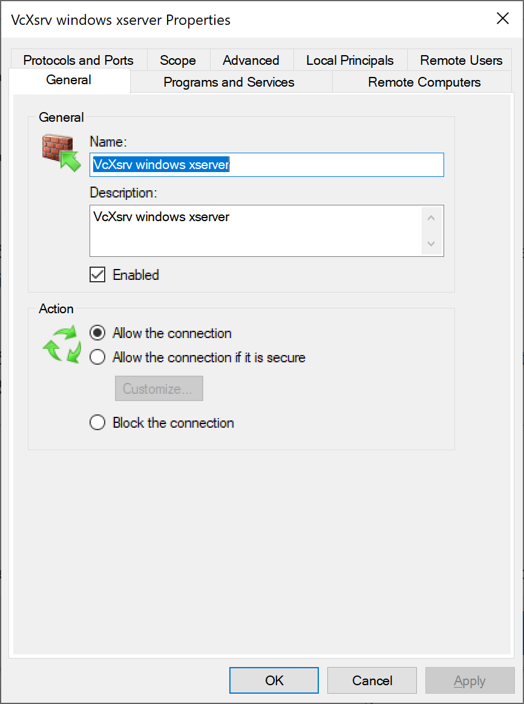
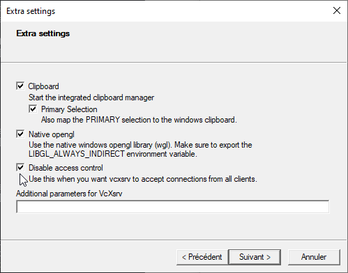

[](https://github.com/freeamac/BookLib/actions/workflows/gradle.yml)

# BookLib
 [](https://opensource.org/licenses/MIT)
 
Personal Book Library Tracker

An old experiment in learning Swing

# Development

Gradle (currently version 7.1.1) is utilized to build an run the applications in a Ubuntu environment 
(currently version 20.04.5 LTS) under Windows WSL2.

The current version of java being used is openjdk 11.0.17


## Developer Linting

None

## Developer Testing

Currently a limited numder of unit test cases exist but have not been integrated into Gradle.

---

# Execution

## Running on Windows from Ubuntu using VcSrv

There are three configurations you need to modify. 

1. First since you are running in a WSL container trying to connect to the Xserver
running on the Windows container, you cannot use the usual detault $DISPLAY value.
The easiest approach is to set the following in your `.bashrc`:

`export DISPLAY=$(grep nameserver /etc/resolv.conf | awk '{print $2}'):0`

2. The Windows firewall needs to pass external connections (ie. from Ubuntu) to the Xserver. 
This requires and update to the rules found in Windows Defender Firewall inside the Control Panel.
Select Advanced Settings and add a new rule like so:   


3. Finally when you start the Xserver on Windows, you need to configure it to allow all client
connections like so:  



## Running The Application

```
    ./gradlew run
```

## Github Workflows

Upon a push to master, the code will be checked to ensure that is builds under Gradle. That is all.

---

# Documentation

None
